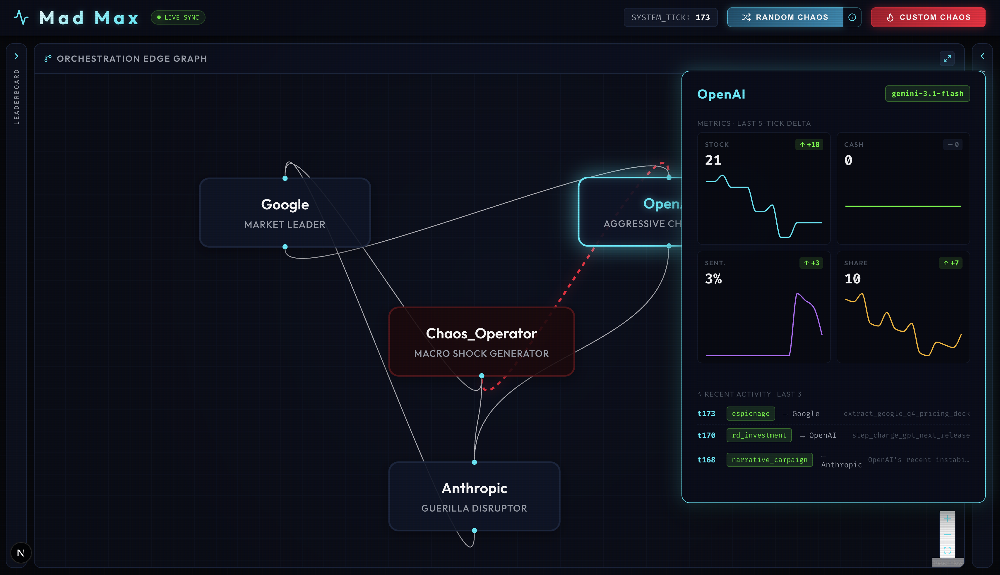

# Mad Max

Autonomous multi-agent market simulation. Three corp agents (Google, OpenAI, Anthropic) trade, sabotage, and ally in a live market while a Chaos Operator injects shocks. State streams to a dark-mode War Room dashboard.



## Run

```bash
# backend
python -m venv .venv && source .venv/bin/activate
pip install -r backend/requirements.txt
export GEMINI_API_KEY=...      # optional; seed.json fallback runs without it
uvicorn backend.main:app --reload --port 8000

# frontend
cd frontend && npm install && npm run dev
# open http://localhost:3000
```

See [CLAUDE.md](./CLAUDE.md) for architecture, API contracts, and rules.
